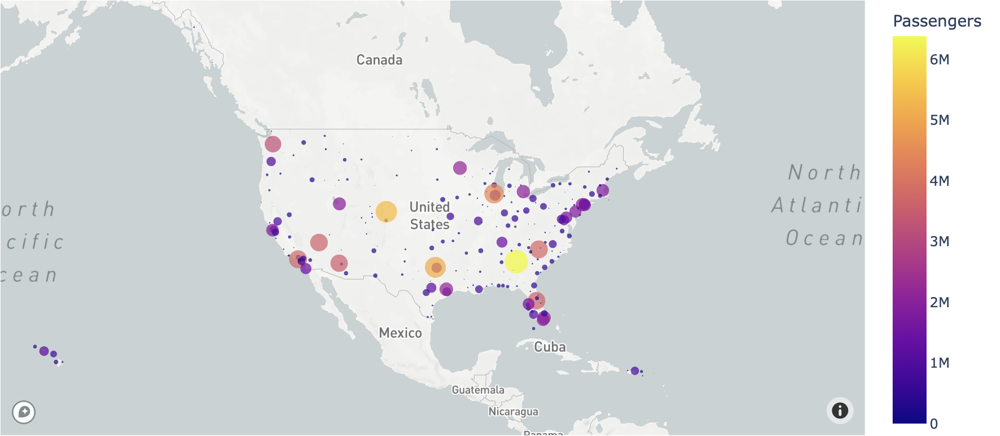

# Airline Transportation Network

This project based on the data from the [Paper](https://towardsdatascience.com/graphs-101-airline-transportation-network-5548739fd22e). 

In this project, you can see the analysis of data containing information about passenger traffic between all US airports in 2021. 
You can take the data from [Goodle drive](https://drive.google.com/drive/folders/1O9TDa2NXHBo3PBORLqwFbQyYjpNcn4tp?usp=sharing).

This article presents an attempt to predict the origin-destination matrix based on the statistical method.
And it also presents label prediction based on methods such as random walk and ridge regression.
